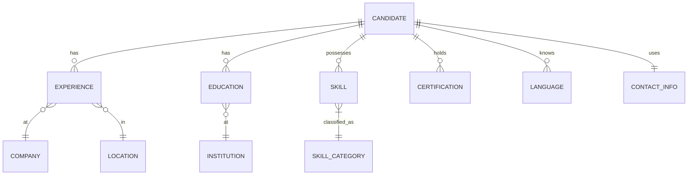

# CV/Resume Best Practices (ATS & AI-Optimized)

## Executive Summary 
- **Structured sections & order:** A modern ATS-friendly CV typically starts with **contact info** (name, email, phone, location, LinkedIn/portfolio), followed by a concise **summary/objective**, **work experience** (reverse-chronological), **skills**, **education**, and relevant extras (certs, languages, projects)【7†L12-L16】【41†L214-L223】. Avoid unrelated info (e.g. references, personal data like age/photo)【14†L124-L128】【26†L80-L85】.  
- **Clear formatting & file type:** Use simple, single-column layouts with standard fonts (10–12 pt body, 14–16 pt headers), 1″ margins, and bullet lists【9†L418-L427】【19†L227-L234】. For ATS scanning, prefer Microsoft Word `.docx` or rich-text formats; PDF is acceptable if explicitly allowed (but beware some ATS may parse PDFs poorly)【19†L213-L221】【1†L55-L60】. Avoid graphics, tables, columns, headers/footers (ATS often skip them)【19†L227-L234】【38†L526-L531】.  
- **Keyword tailoring:** Extract role-specific keywords from the job description and company, and weave them *naturally* into your summary, bullets and skills【19†L178-L186】【11†L557-L564】. Each application should use a “master CV” but be **customized** per posting: highlight repeated keywords, mirror the job’s language in section headings and bullet points, and reorder bullets so the most relevant accomplishments appear first【9†L456-L462】【19†L264-L272】. Do *not* simply dump uncontextualized keywords as a list【19†L198-L207】.  
- **Active, quantified style:** Write in concise, active-voice bullets that start with strong verbs (e.g. *Led, Managed, Developed*) and include concrete results (e.g. “increased sales 20%” or “managed a 5-person team”)【6†L230-L236】【38†L571-L578】. Use honest, specific language. AI tools can help refine phrasing or fill missing keywords, but avoid fabrications, jargon, or generic corporate-speak【9†L481-L489】【38†L490-L495】.  
- **ATS pitfalls to avoid:** Standardize section headings (e.g. “Work Experience” not “Career Journey”), **spell out acronyms** on first use, and use dates in a consistent format (MM/YYYY)【1†L40-L45】【19†L303-L310】. Skip images, charts, text boxes, and special characters that can break parsing【19†L227-L234】【38†L526-L531】. Put critical text in the body (not headers/footers)【19†L256-L262】【41†L267-L275】. Finally, **proof** the resume by converting it to plain text or an ATS simulator to catch formatting errors【19†L312-L319】【21†L123-L129】.  
- **Metadata & naming:** Name your file clearly with your *full name* and role (e.g. `John_Doe_Software_Engineer.docx`), using underscores or hyphens (no spaces/special chars)【21†L74-L82】【21†L89-L94】. ATS sometimes scan file names for organization【21†L54-L62】. Keep metadata clean and minimal.  
- **Global considerations:** For international roles, adapt the format and language. Translate core sections accurately (use human or AI-assisted translation, then proofread)【23†L194-L202】. Localize keywords and data formatting (e.g. date, currency) per locale【24†L39-L45】【24†L53-L58】. Use one of the standard resume formats globally: reverse-chronological or combination for most, or functional for major career changes【41†L225-L226】【41†L238-L247】. In some countries (e.g. parts of Europe), adding a photo or nationality is optional/legal, but *never* do so for U.S./Canada (to avoid bias and legal issues)【26†L139-L148】. Include languages spoken if relevant.  
- **Privacy & bias:** Exclude sensitive personal details (age, gender, race, religion, social IDs, photos)【14†L124-L128】【26†L80-L85】. Studies show automated screening can reflect biases (e.g. by name or demographics)【30†L1-L4】【27†L227-L236】, so focus CV content on skills/achievements. Use gender-neutral language (avoid pronouns) and factual descriptions. Ensure your AI-generated text doesn’t inadvertently encode stereotypes.  
- **Validation & metrics:** Automate quality checks. Key metrics include **ATS parse success**, **keyword-match score**, and **readability/consistency**. For example, use open-source parsers (e.g. [LeverParser](https://github.com/wespiper/pyresume) or similar) to verify all sections extract cleanly【40†L308-L313】【19†L312-L319】. Compute a match percentage against target job requirements (tools like ResyMatch target ~75%【1†L47-L54】). Check spelling/grammar with language tools and run a plain-text render to catch hidden formatting glitches【19†L312-L319】. Optionally score the CV on readability (e.g. passive voice count, Flesch score). An automated **checklist** (below) can enforce these rules before final output.  
- **Templates & integration:** Implement a library of **simple, ATS-tested templates** (e.g. single-column Word or LaTeX templates【35†L274-L283】). Use resume-parsing libraries to extract and validate each field. Develop heuristics to “score” outputs: number of sections present, presence of action verbs, quantifiers, keyword coverage, etc. Allow modular sections (e.g. optional “projects”, “languages”). Provide export to `.docx`/`.pdf` with clean styles. Integrate an ATS checker (even a basic regex-based one) to flag fatal issues. Log metrics and let users iterate.  

**Sources:** Official career sites (LinkedIn, Indeed, Glassdoor), industry blogs, academic research (ATS/AI screening), and open-source tools【7†L12-L16】【19†L178-L186】【38†L553-L561】【40†L308-L313】.

## 1. Essential Sections & Order 
A recruiter- and ATS-friendly CV in most fields follows a clear structure【7†L12-L16】【41†L214-L223】. Common elements (in order) include: **Contact Information** (name, phone, professional email, city/state, LinkedIn/github/website links)【7†L21-L28】【41†L265-L273】; a brief **Professional Summary or Objective**; **Work Experience** (reverse-chronological); **Skills** (hard/soft); **Education** (degree, institution, dates); and any **Certifications, Projects, Publications or Languages** relevant to the role【7†L12-L16】【41†L225-L226】.  
- *Rationale:* Standard headings (e.g. “Work Experience”, “Education”) ensure ATS parsers map content correctly【38†L553-L561】【7†L12-L16】. A top header summarizing the candidate’s expertise (“Experienced Software Engineer…”) or career objective (for juniors/industry-changers) helps a human quickly gauge fit【41†L286-L295】【41†L225-L226】.  
- *Examples:*  
  - **Contact:** “Jane Doe • (555) 123-4567 • jane.doe@email.com • Seattle, WA • linkedin.com/in/janedoe”【6†L277-L284】【7†L21-L28】.  
  - **Summary:** A 2–4 line pitch: *“Data analyst with 5+ years’ experience in finance, skilled in Python, SQL, and machine learning. Improved forecasting accuracy by 30%. Seeking to apply data-driven insights to drive business growth.”*【41†L292-L300】【6†L230-L236】.  
  - **Experience entry:** *“Software Engineer, TechCorp (NY, NY), 06/2020–Present. • Led a 4-person team to develop a REST API that reduced data retrieval time by 50%. • Automated QA testing using Python/Selenium, cutting bugs by 25%.”*【6†L230-L236】【6†L287-L290】.  
- *Rules/heuristics:*  
  - **Contact line** must include name, phone, email, city/state; optional links (LinkedIn, GitHub) in the same line【7†L21-L28】. Avoid headers/footers for this (ATS might skip them)【19†L256-L262】【41†L267-L275】.  
  - **No Personal Data:** Exclude age, marital status, photo etc. (these are common international no-nos and often illegal biases)【14†L124-L128】【26†L80-L85】.  
  - **Section Headings:** Use conventional titles (“Experience”, “Education”, “Skills”)【1†L40-L45】【38†L553-L561】. Unusual titles (“Track Record” etc.) can confuse ATS.  
  - **Reverse-Chronology:** List most recent jobs first【41†L225-L226】. Functional or hybrid formats (see next section) can alter this, but each entry should still have title, company, dates, location.  
  - **Bullet Points:** For each job, list 3–6 bullets with duties and **quantified** results, starting with action verbs【6†L230-L236】【6†L287-L290】. Avoid paragraphs.  
  - **Skills Section:** List relevant hard/technical skills (programming languages, tools) and select soft skills. Only include skills that match the job’s requirements【6†L239-L247】【38†L553-L561】. Separate with commas or columns in one line.  

## 2. Formatting & ATS-Compatible File Types 
**Layout & style:** Use a single-column, uncluttered design. Stick to black text on white, with simple fonts (Calibri, Arial, Times, or LaTeX fonts like Tinos)【9†L418-L427】【35†L274-L283】. Keep margins ~0.5″–1″; font sizes 10–12pt for text, 14–16pt for headings【9†L418-L427】. Bullet lists should use standard symbols (● or –). Avoid fancy formatting (shading, multiple columns, text boxes)【19†L227-L234】【38†L526-L531】. Save consistent spacing between sections and entries. Example snippet:  

```
John Doe – (555) 123-4567 – john.doe@email.com – 
Seattle, WA – linkedin.com/in/johndoe
Professional Summary
Data analyst with 7+ years’ experience in healthcare analytics...
Work Experience
Sr. Data Analyst, HealthCorp (Seattle, WA) 07/2018–Present
• Led data migration that improved reporting speed by 40%.
• Developed predictive model in Python, reducing readmission rates by 15%.
...
Skills: Python, SQL, Tableau, R, Statistics, Machine Learning  
Education: M.S. in Data Science, University X (2016)
```

- **File format:** Prefer `.docx` or rich text (`.rtf`, `.txt`) for ATS submissions. Many ATS parse these flawlessly. If the posting explicitly allows PDF, you may submit a PDF for consistent layout, but be aware some ATS have trouble reading PDFs (they may rasterize them)【19†L213-L221】【1†L55-L60】. In practice, `.docx` is safest for keyword scanning【19†L213-L221】.  
- **Do’s:**  
  - Use a **plain header** (no images or logos). Copy contact info into the body.  
  - Label dates clearly (month/year or YYYY)【1†L40-L45】. Use consistent date formats.  
- **Don’ts (ATS pitfalls):**  
  - **No graphics/visuals:** Charts, logos, headshots, or embedded text boxes will be skipped by ATS【19†L227-L234】【38†L526-L531】.  
  - **No tables/columns:** ATS parse left-to-right and may jumble columnar layouts【19†L227-L234】.  
  - **No special symbols:** Fancy bullets (★, ►) or nonstandard characters can break parsing. Use simple hyphens or circles【19†L227-L234】.  
  - **Color/icons:** Only black text. Color or icons (e.g. social icons) may confuse parsers【10†L37-L40】.  

## 3. Keywords & Tailoring 
Modern ATS (and recruiters) look for **keywords**: exact job titles, skills, tools, and certifications mentioned in the job posting【11†L537-L545】【19†L178-L186】. To optimize:  
- **Extract key terms:** Carefully scan the job description and company profile. Note recurring skills, qualifications, and action verbs. For each role, aim to include the majority of those terms【19†L178-L186】. Example: if the JD lists “project management, Python, Agile, leadership,” ensure those words appear in your CV sections and bullets.  
- **Contextual integration:** Don’t just list words in isolation. Instead, embed them naturally in sentences. E.g., instead of a bare skill list, write “Managed **Agile** software teams” or “Built ETL pipelines with **Python**”【19†L198-L207】. This helps ATS (and humans) see them in context. For instance:  
  - Instead of “Python, C++, Java” in Skills, you might write a bullet: “Developed data pipelines in **Python** and **C++** to automate report generation”【19†L198-L207】.  
- **Tailor summary & sections:** Rewrite your summary and skills list to echo the role. If the JD emphasizes “data visualization” and “SQL,” mention those in the summary and skills【9†L456-L462】【38†L553-L561】. Adjust section order if needed (e.g. move a special project to top if it closely matches the job).  
- **Match language:** Mirror phrasing from the posting. If the job calls for a “Senior Marketing Manager,” use that exact title under your current role (if applicable) rather than a synonym【19†L178-L186】【38†L553-L561】.  
- **Avoid keyword-stuffing:** ATS are smart enough to penalize nonsensical keyword lists. Use the **Resume Match Score** metaphor: aim for ~75% overlap on a tool like ResyMatch【1†L47-L54】, but ensure the text still reads like valid descriptions. Never include irrelevant jargon just to trigger filters.  

*Example:* If a job asks for “experience with Google Analytics”, you might have a bullet: “Analyzed website traffic using **Google Analytics**, identifying user trends that drove a 10% increase in engagement.” This uses the keyword in a relevant way【19†L198-L207】.  

## 4. Style & Tone (for AI-Generated Content) 
**Clarity and honesty:** CVs should be concise, clear, and truthful【38†L571-L578】【9†L490-L495】. When using AI to help write or polish CV text:  
- **Good AI uses:** Refining phrasing, correcting grammar, highlighting missing keywords, and tightening bullets【9†L481-L489】. E.g. ask an LLM to reword “responsible for managing inventory” into “Managed inventory…”, or to list possible metrics you might have measured.  
- **Bad AI uses:** Letting AI invent metrics or full accomplishments, stuffing generic corporate-speak, or adding jargon you can’t explain【9†L481-L489】【38†L490-L495】. Always fact-check and personalize any AI output.  
- **Active voice:** Begin bullets with past-tense active verbs (e.g. *“Led, Optimized, Designed”*). Avoid “was responsible for” constructions. Example:  
  > *Good:* “**Led** a cross-functional team of 5 to deliver a $1M project on time.”【6†L287-L290】  
  > *Poor:* “Was responsible for a cross-functional team delivering a project.”  
- **Quantification:** Whenever possible, add numbers to quantify impact (sales, savings, efficiency gains)【6†L230-L236】【6†L287-L290】. Example: “Reduced processing time by 30%” or “increased customer retention 15%”.  
- **Tone:** Use a professional but dynamic tone. Avoid clichés like “hard-working individual” that add no information. Keep descriptions objective (e.g. “Strategic thinker” is vague) and focus on *what you did* and *the result*. The CV should make your value obvious【38†L571-L578】.  
- **Consistency:** Use present tense for your current role, past tense for prior roles. Maintain consistent date formats and verb styles throughout.  

## 5. Common ATS Pitfalls & Avoidance 
To ensure maximum ATS compatibility, watch for these common issues:  
- **Excess formatting:** Graphs, tables, multi-column layouts, and text boxes are frequent culprits that break parsing【19†L227-L234】【38†L526-L531】. Keep everything linear.  
- **Complex section titles:** Creative headings like “Where I’ve Been” or “My Journey” will confuse ATS【19†L292-L300】. Stick to recognized labels (Work Experience, Education, Skills, etc.)【1†L40-L45】【38†L553-L561】.  
- **Header/Footer traps:** Avoid placing contact info (or other critical text) in page headers/footers; many ATS ignore them【19†L256-L262】【41†L273-L281】. Put your name and contact in the main document body.  
- **Unrecognized characters:** Specialty bullets (emojis, dingbats), asterisks on the same line as text, or older font encodings can be read as gibberish【19†L227-L234】. Use plain ASCII punctuation and standard bullet symbols.  
- **Charts/images:** Do not include logos or charts. An ATS will either skip these or parse meaningless text like “Figure”. Instead, convert key info into text (e.g. “Created chart showing 20% sales growth”⇒ bullet text).  
- **Spelling/grammar:** Typos can confuse parsers (and damage your impression). Use spell-check and ideally have a person review for glaring errors.  
- **Overuse of color/graphics:** If using color for headings or bullet points, ensure adequate contrast and avoid clipping (ATS reads only text, so some color-coded text might be missed【10†L37-L40】). Plain black text is safest.  

**Tip:** As you draft, periodically **export to plain text** and scan for anomalies (misaligned headings, garbled characters). If something looks off in the text dump, fix the source. Some resume-builders offer an “ATS scan” feature; running your draft through such a checker can identify hidden issues【19†L312-L319】【21†L123-L129】.

## 6. Filenames, Metadata & Contact Info 
- **Filenames:** Name your resume file clearly. Include your name and optionally the target role or company (e.g. `Jane_Doe_Data_Analyst.pdf`)【21†L74-L82】【21†L89-L94】. Replace spaces with underscores/hyphens, and use an ATS-friendly extension (.docx, .pdf). Avoid vague names like `resume_final.docx` or special characters that can break upload systems【21†L74-L82】【21†L89-L94】.  
- **Metadata:** When possible, clear the file metadata (Title, Author) or set the title to something relevant. Some ATS index metadata, so a professional file title (not “untitled”) helps【21†L54-L62】.  
- **Contact details:** List a personal email (professional username) and reachable phone number on **every page**. Some guidance suggests including city/state or country (for international context)【7†L21-L28】【41†L265-L273】. Ensure hyperlinks (LinkedIn, GitHub) are formatted plainly (no full URLs hidden behind icons).  
- **Online profiles:** Linking to LinkedIn/GitHub/Portfolio pages is recommended if relevant to the role; ensure those profiles are up-to-date【7†L21-L28】【41†L269-L271】.  
- **No sensitive data:** Do *not* include SSNs, birthdates, health or marital status, or any identifiers beyond professional contacts【14†L124-L128】【26†L80-L85】.  

## 7. Multilingual & Internationalization 
For a **global job market**, internationalizing resumes can boost reach:  
- **Language versions:** If applying in another country or language, consider providing a translated version. Use AI or professional help to translate core sections, then manually verify. Preserve **tone and industry terms** (some phrases don’t translate directly)【23†L194-L202】. Example: “Led a team of 12” ⇒ “Dirigí un equipo de 12 personas…” (with currency/dates in local format)【23†L202-L208】.  
- **Format & content:** Choose a universally accepted structure (usually reverse-chronological or combination)【41†L225-226】【41†L238-247】. Keep fonts and symbols simple (use Arial/Calibri, avoid region-specific currency or symbol unless localizing for that market)【23†L179-L187】. Adapt date formats (e.g. 01/2025 vs “Jan 2025”) to local norms【24†L53-L58】.  
- **Keywords by region:** Different countries may use slightly different jargon or qualification names. Research the local job-market terms: a UK tech resume may require “BSc” vs “BS” or use “CV” heading instead of “Resume”【26†L139-L148】. Use a keyword tool (or the same JD tailoring approach) for each language/locale【24†L39-L45】【24†L53-L58】.  
- **Lengths and sections:** Note that “CV” in academia (Europe) can be 2–3+ pages with detailed sections (publications, etc.), whereas business resumes (US, Canada, AUS) are 1–2 pages【26†L79-L85】【26†L139-L148】. If targeting academia or regions where CVs are expected, include more detail accordingly.  
- **Local customs:** Some countries expect a photo or even marital status (e.g. parts of Europe, Middle East). If *required*, include them on separate lines (with small professional headshot), otherwise **omit** to avoid legal issues【26†L139-L148】. Always check current norms for the target region.  

## 8. Privacy & Bias Mitigation 
Automated tools can inadvertently propagate bias, so it’s best to **minimize identifiable information**:  
- **Exclude protected traits:** Never list religion, ethnicity, political affiliation, gender pronouns, or personal images. Research shows AI screening can discriminate by gender, race or intersections【30†L1-L4】【27†L227-L236】.  
- **Focus on skills/results:** Let your experience speak. Describe *what* you did, not *who* you are. For example, use "engineered a solution" rather than "he engineered" (avoids gender reference).  
- **Consistent tone:** Use neutral language (“led team” not “chairman”; avoid gendered terms). Check for pronoun usage.  
- **Blind formatting:** Some ATS or job sites allow “blind applications” where name and address are removed. While rare for resumes, your app could offer a privacy-preserving mode (e.g. no name field) if needed.  
- **Data security:** If storing user inputs (for your CV builder), comply with privacy regulations (GDPR, etc.). When outputting, don’t embed hidden tracking info.  

On the **recruitment side**, structured ATS can actually reduce bias by focusing on objective criteria【13†L62-L70】, but only if designed carefully. Educate users that their CV should be judged on **skills and metrics**, and ensure your AI doesn’t leak sensitive language or stereotypes into the text.  

## 9. Evaluation Metrics & Automated Testing 
To systematically validate CV quality, implement both **heuristic checks** and **quantitative metrics**:  

- **Parsing Success:** Use an ATS resume parser (e.g. LeverParser/pyresume【40†L308-L313】) to extract all expected fields. A score (percentage of fields correctly parsed) can flag formatting issues. Check that name, contact, education, experience, and skills are all recognized.  
- **Keyword Coverage:** For a given JD, compute a match score (many match tools use resume-vs-description overlap). Aim for a high overlap (ResyMatch recommends ~75% relevance【1†L47-L54】).  
- **Section Checklist:** Ensure required sections exist. A table-driven check might confirm presence of `<Summary>, <Experience>, <Skills>, <Education>` headers.  
- **Bullet Quality:** Check bullets for presence of a verb (regex for uppercase + verb at line start) and a numeral (to encourage quantification).  
- **Readability/Grammar:** Integrate a spell-checker and grammar tool. Optionally compute a readability index.  
- **Format Checks:** Confirm no forbidden elements: scan for images (`` tags if HTML), or unusual characters. Validate that file is `.docx/.pdf` and not exceeding size limits.  
- **ATS Simulation:** Automate a plain-text conversion and diff it with the original to catch missing segments【19†L312-L319】. You could also feed the CV through an open-source ATS scanner or a pre-trained language model to see if it identifies missing contact or scrambled sections.  
- **Performance Thresholds:** For continuous integration, set heuristic thresholds (e.g. “no parse errors, ≥X% keyword match, <2 spelling errors”). If CV fails any test, flag for user revision.  
- **User Feedback Loop:** Provide a “CV Score” dashboard with these metrics so users can iteratively improve before finalizing.  

**Checklist Table (Sample):**

| Checkpoint              | Criteria/Expectation                                                                            | Source              |
|-------------------------|-----------------------------------------------------------------------------------------------|---------------------|
| **Contact Info**        | Name, phone, email, location in body (not header). LinkedIn/URL optional.                     | 【7†L21-L28】【41†L265-L273】 |
| **Summary**             | 2–4 sentences summarizing value, with role keywords.                                          | 【41†L292-L300】【38†L553-L561】 |
| **Experience Section**  | Reverse-chronological. Each entry has title, company, dates, location, bullet achievements.     | 【6†L230-L236】【41†L225-L226】 |
| **Skills Section**      | Lists relevant skills (hard skills first). No irrelevant skills.                               | 【6†L239-L247】【38†L553-L561】 |
| **Education**           | Degrees, schools, grad years (if recent). No GPA.                                             | 【14†L252-L259】      |
| **Formatting**          | Single-column, 10–12pt font, no tables/graphics/images. Margins ~0.5″–1″.                      | 【9†L418-L427】【19†L227-L234】 |
| **Section Headings**    | Standard titles (“Work Experience”, “Education”, etc.).                                        | 【1†L40-L45】【38†L553-L561】 |
| **Keywords**            | Included naturally (check against target JD).                                                | 【19†L178-L186】【11†L557-L564】 |
| **Action Verbs**        | Bullets start with strong verbs (Led, Managed, Built...).                                     | 【6†L287-L290】       |
| **Quantification**      | Many bullets contain numbers, percentages, metrics.                                           | 【6†L230-L236】【6†L287-L290】 |
| **Acronyms**            | First use spelled out, then acronym (e.g. *Search Engine Optimization (SEO)*).                | 【19†L303-L310】     |
| **Plain Text Test**     | When converting to TXT, content remains coherent (no data loss).                              | 【19†L312-L319】     |
| **File Name/Meta**      | Filename = “Firstname_Lastname_Role.ext”; underscores/hyphens, .docx or .pdf.                | 【21†L74-L82】【21†L89-L94】 |
| **No Personal Bias**    | No photo, DOB, marital status, or pronouns.                                                   | 【14†L124-L128】【26†L80-L85】 |

Any failure should be reported back to the user for correction. 

## 10. Implementation Suggestions for Your App 
- **Templates:** Provide a set of clean CV templates (Word `.docx` or HTML/CSS) adhering to ATS rules【35†L274-L283】. Users input data into fields (name, jobs, etc.) and the app populates a template. Consider a Markdown or JSON intermediate to structure content, then render to `.docx`/`.pdf`.  
- **Parsing Checks:** Integrate an open-source resume parser (e.g. [pyresume/LeverParser](https://github.com/wespiper/pyresume)) to pull out all sections and flag missing pieces【40†L308-L313】. Use its confidence scores to gauge reliability.  
- **Scoring Heuristics:** Implement a CV “audit” that applies the checklist above. For example, use regex or NLP to count action verbs, numbers, section labels, and keywords. Provide inline suggestions (e.g. “Add specific metrics under *Accomplishments*”).  
- **Keyword Tools:** Allow users to paste a job description and auto-extract keywords (like an on-board JobScan). Compute an overlap score to guide keyword inclusion.  
- **Bias Filter:** Before finalizing, scan the text for sensitive terms (names, pronouns, honorifics) and warn if they appear. Perhaps integrate a known bias-detection API or simple lookup of protected classes.  
- **User Feedback:** Show automated metrics: ATS parse status, keyword match %, reading level, etc. Offer actionable tips (“Your resume lacks a summary; consider adding 2-3 lines about your value” or “Use an active verb instead of ‘responsible for’ in bullet 3”).  
- **Continuous Updating:** Keep templates and keyword lists updated (e.g. annual checks of LinkedIn’s hiring reports or new ATS trends).  
- **Mermaid Diagrams (Suggested):**  
  - **Workflow:** For example, a flowchart from “User Data Input” → “Populate Template” → “Formatting Engine” → “ATS Parser Check” → “Scorecard & Feedback” → “Final Resume Output”.  
  - **Data Model:** An ER diagram for the CV schema: *Candidate* has many *Experience*, *Education*, *Skill*, *Certification*, etc., each with attributes (dates, titles, institutions).  

```mermaid
flowchart TD
    A[User Profile Data] --> B[Resume Template Engine]
    B --> C[Format Conversion (DOCX/PDF)]
    C --> D{Validation \& Scoring}
    D -->|Parse Test| E[Resume Parser (ATS)]
    D -->|Keyword Analysis| F[Keyword Matcher vs JD]
    D -->|Style Check| G[Grammar/Active-Verb Analyzer]
    E --> H[Validation Report]
    F --> H
    G --> H
    H --> I[Feedback to User / Final Resume]
```



These suggestions aim to transform best-practice guidelines into concrete app features: **template-driven output**, **automated validation tests**, and **feedback loops**. Together with the above rules (sourced from LinkedIn, Indeed, Glassdoor, and research), your CV builder can generate resumes that look great to both machines and humans【38†L553-L561】【40†L308-L313】.

